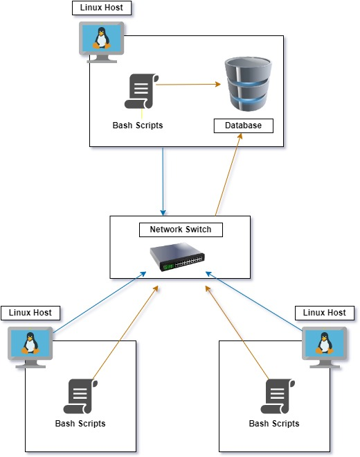

# Linux Cluster Monitoring Agent
# Introduction
The Linux Cluster Monitoring Agent is a tool that is designed to record the
hardware specifications and system resource usage data of remote Linux servers and
storing the data in a relational database management system. By installing
this tool in remote nodes the Linux Cluster Administration team can analyze
the data and generate plans for future resource management.

A List of Technologies used:
- Linux
- Bash
- Docker
- PostgreSQL
# Quick Start
```
# Create and run PostgreSQL instance
./scripts/psql_docker.sh create [username] [password]

# Start/Stop a PostgreSQL instance
./scripts/psql_docker.sh start
./scripts/psql_docker.sh stop

# Create tables using ddl.sql
psql -h localhost -U [username] -d host_agent -f ./sql/ddl.sql

# Insert hardware specs data into the DB 
./scripts/host_info.sh localhost 5432 [database] [username] [password]

# Insert hardware usage data into the DB using host_usage.sh
./scripts/host_usage.sh localhost 5432 [database] [username] [password]

# Crontab setup for host_usage.sh automation

# Open Crontab editor
crontab -e

# Enter and save in editor:
***** [absolute path to]/linux_sql/scripts/host_usage.sh localhost 5432 [database] [username] [password]

```
# Implementation
This project was implemented in 4 main steps.

1. The first task was to create the `psql_docker.sh` bash script that can
   create, start and stop a docker container running PostgreSQL. The purpose
   of the PostgreSQL container is to set up a database to store information
   about the host system's hardware specifications and resource usage data.

2. The next step was to create a schema in the `ddl.sql` file to define the
   two tables in the database for the host_info and host_usage.
   The tables are populated by data gain when the `host_info.sh`
   and `host_usage.sh` shell scripts are run.

3. After setting up the database structure the next step was to create
   the two shell scripts to obtain the necessary data and insert them into the
   psql databases. The `host_info.sh` script uses the lscpu command to obtain
   the hardware specifications of the host and the `host_usage.sh` script uses
   the vmstat command to obtain the resource usage data.

4. Lastly a `cron` job is used to automate the host_usage script so
   that new resource usage data is inserted into the database at regular
   intervals of 1 minute.

## Architecture

## Scripts

- `psql_docker.sh` - This script executes three possible commands,
  creating, starting, and stopping the psql docker container.
```
# Creating and running the psql docker container
./scripts/psql_docker.sh create [username] [password]

# starting the container after ending it
./scripts/psql_docker.sh start

# stopping a running container
./scripts/psql_docker.sh stop
```
- `host_info.sh` - This script obtains system hardware specifications
  and inserts the data into the host_info table in the database.
```
# Get Hardware specifications and insert them into the DB.
./scripts/host_info.sh localhost 5432 [database] [username] [password]

```
- `host_usage.sh` - This script obtains system hardware resource usage
  and inserts the data into the host_usage table in the database.
```
# Get Hardware resource usage and insert it into the DB.
./scripts/host_info.sh localhost 5432 [database] [username] [password]

```
- `crontab` - Automates the `host_usage.sh` script to run at intervals of 1 minute.
```
# Open Crontab editor
crontab -e

# Enter and save in editor:
***** [absolute path to]/linux_sql/scripts/host_usage.sh localhost 5432 [database] [username] [password]
```
## Database Modeling

### host_info table schema

| Properties       | Description                                                              |
|------------------|--------------------------------------------------------------------------|
| id               | Unique Serial - Primary Key identifier                                   |
| hostname         | Unique Varchar - the name of the host machine                                |
| cpu_number       | Integer - number of CPUs in the host machine                             |
| cpu_architecture | Varchar - CPU architecture type                                          |
| cpu_model        | Varchar - CPU model name                                                 |
| cpu_mhz          | Numeric - the CPU clock speed in MHz                                     |
| L2_cache         | Integer - the size of L2 cache in the CPU in KB                          |
| total_mem        | Integer - the size of the total memory in the host machine in KB         |
| timestamp        | Timestamp - the timestamp of when the data is collected in the UTC zone |


### host_usage table schema

| Properties     | Description                                                                   |
|----------------|-------------------------------------------------------------------------------|
| timestamp      | Timestamp - the timestamp of when the data is collected in the UTC zone      |
| host_id        | Integer Foreign Key - referencing the id of the host machine                  |
| memory_free    | Integer - amount of free memory for the host machine in MB                    |
| cpu_idle       | Integer - percentage between 0 and  100 of the CPU that is idle               |
| cpu_kernel     | Integer - percentage between 0 and  100 of the CPU that is used by the kernel |
| disk_io        | Integer - number of disk I/O that the host machine has                        |
| disk_available | Integer - the amount of available disk space on the host machine in MB        |

# Test

Manually tested all bash scripts and SQL statements using a VM instance
running on the Google Cloud Platform. Tested network capabilities by assigning
a port to the psql container so that I could assure the commands would
work across a network cluster of Linux systems. Verified functionalities
directly by ensuring the correct data were inserted into the SQL database.

# Deployment
Source code and version control are managed using Git and Github.
The PostgreSQL database is created as a docker container instance.
A `cron` job is scheduled with storing the resource usage data
in the database at regular intervals.

# Improvements

- Currently, hardware updates are not considered.
  The script to store the hardware information runs only once so if
  new hardware is installed that information isn't stored in the database.
  One solution to this is to set up an automation that is scheduled
  longer than the resource usage cron job in case there are any hardware changes.


- More types of resources can have their usage tracked.
  For example network usage rates can be tracked to see the efficiency
  of the network.


- An option to export the data stored in the database into a more readable format. This could include graphs and tables in an easy-to-read GUI. 
